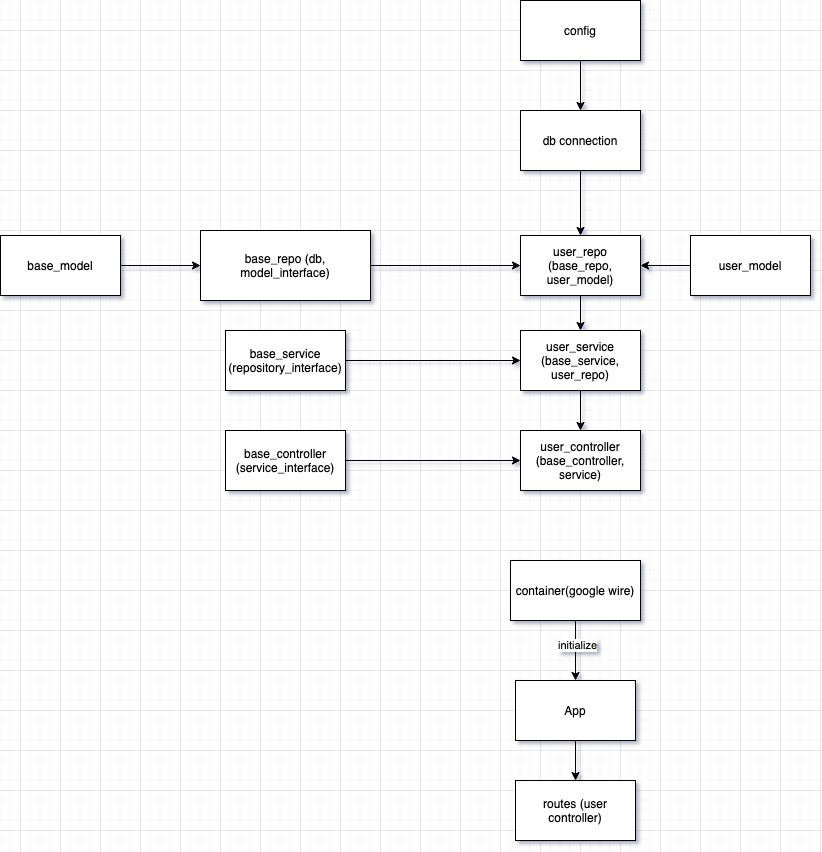

# Go GraphQL

Go (Golang)🚀 GraphQL API + Postgres

## Project Targets:

- Get used to Go and GraphQL concepts.
- Can understand how GraphQL operate.
- Difference between GraphQL and API.
- Best practices for GraphQL and Golang.

**Flow Chart**



## Technologies used:

- Golang
- Docker
- GraphQL
- Postgres
- Wire

## Golang best practices:

**Function**

```text
Use camel case, exported functions should start with uppercase
```

**File**

```text
- File names that begin with “.” or “_” are ignored by the go tool
- Files with the suffix _test.go are only compiled and run by the go test tool
```

**Variables**

```text
- Use relatively simple (short) name
- Single letter represents index: i, j, k 
```
