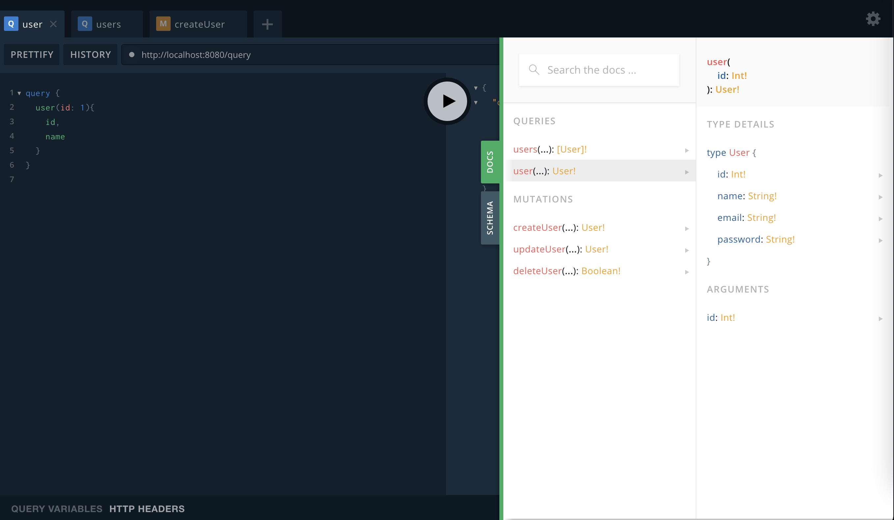

## Features

- [x] DI - [Google Wire](https://github.com/google/wire)
- [x] Logging - [Logrus](https://github.com/Sirupsen/logrus)
- [x] Linter - [Go Linter](https://github.com/golangci/golangci-lint)
- [x] Docker Support
- [x] Pre commit
- [ ] Dataloader
- [ ] Caching
- [ ] Testing

## Installation

### Run

Run go lint

```bash
make go-lint
```

Start server

```bash
make sv-start
```

## Screenshots


